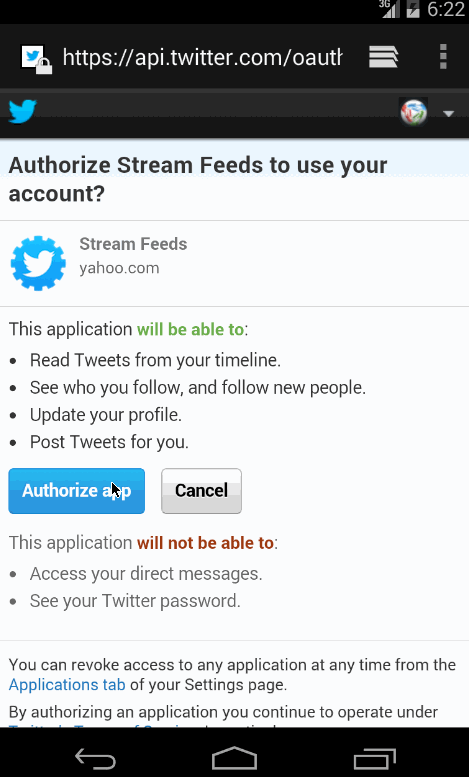

Simpe Twitter
==================
How many hours did it take to complete?
16 hours

Which required and optional stories have you completed?

*User can switch between Timeline and Mention views using tabs.
*User can view their home timeline tweets.
*User can view the recent mentions of their username.
*User can scroll to bottom of either of these lists and new tweets will load ("infinite scroll")
*User can navigate to view their own profile
*User can see picture, tagline, # of followers, # of following, and tweets on their profile.
*User can click on the profile image in any tweet to see another user's profile.
*User can see picture, tagline, # of followers, # of following, and tweets of clicked user.
*Profile view should include that user's timeline
* 

